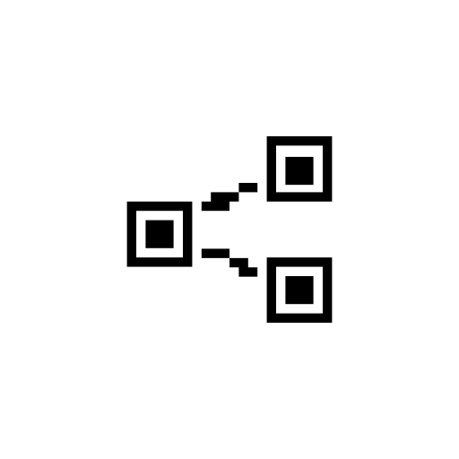

#  QRshare

Share QR code links using android's share sheet.

### Download

---

### Use cases:
- Sharing links quickly. 
  - eg:
    - Sharing app links for profiles: Instagram / Vemo / Whatsapp / Telegram / etc.
    - Web pages
- Sharing contacts
  - Contact app > Share > QRshare
- Sharing text files
  - File manager > Share > QRshare

### QR code scanning:
- To keep things simple, QR code scanning will not be added.

### Images

<description>
Promo Screenshots

</description>
