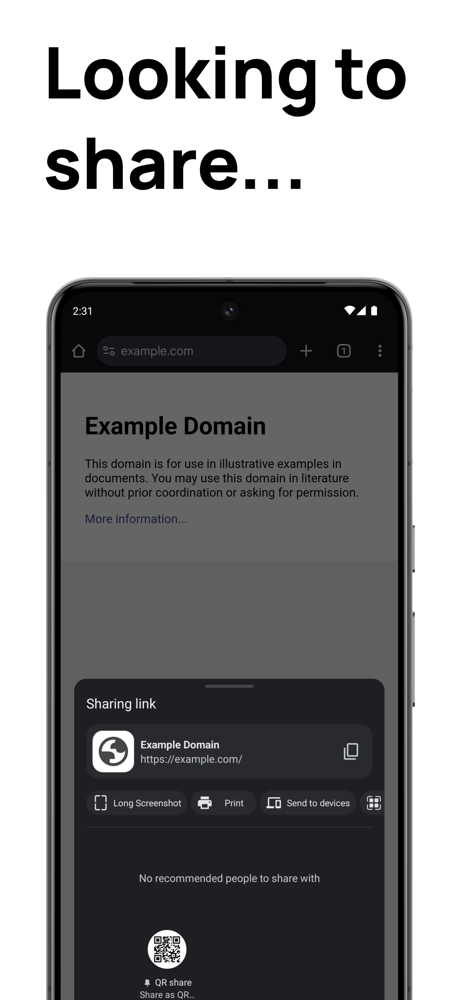
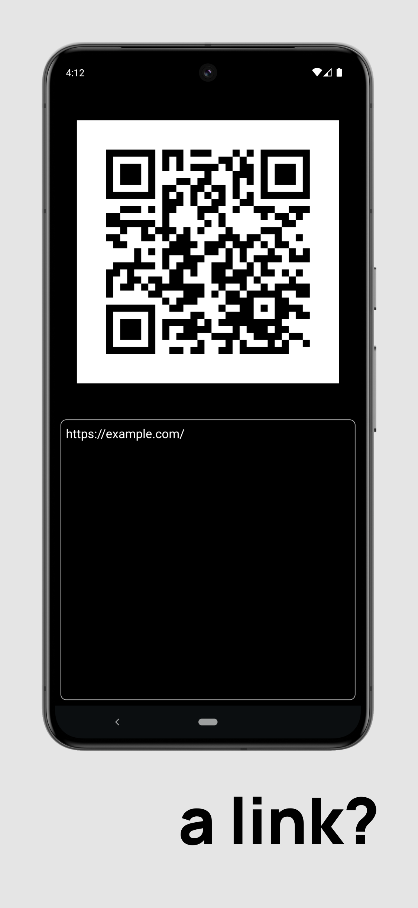
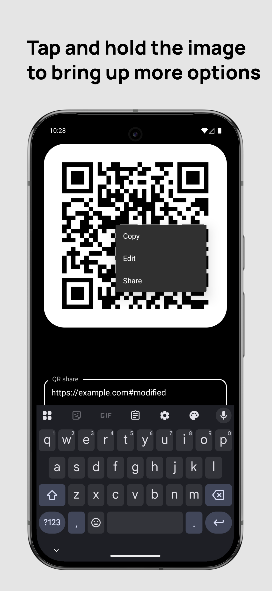
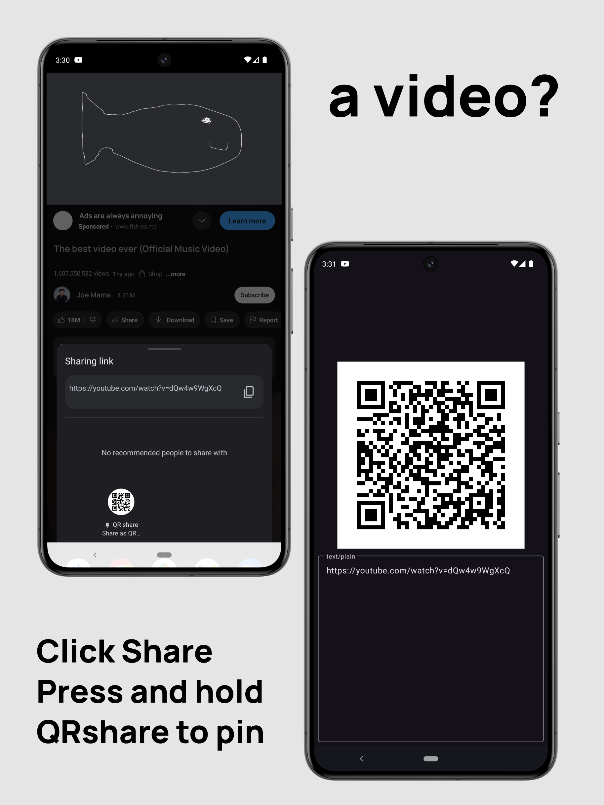
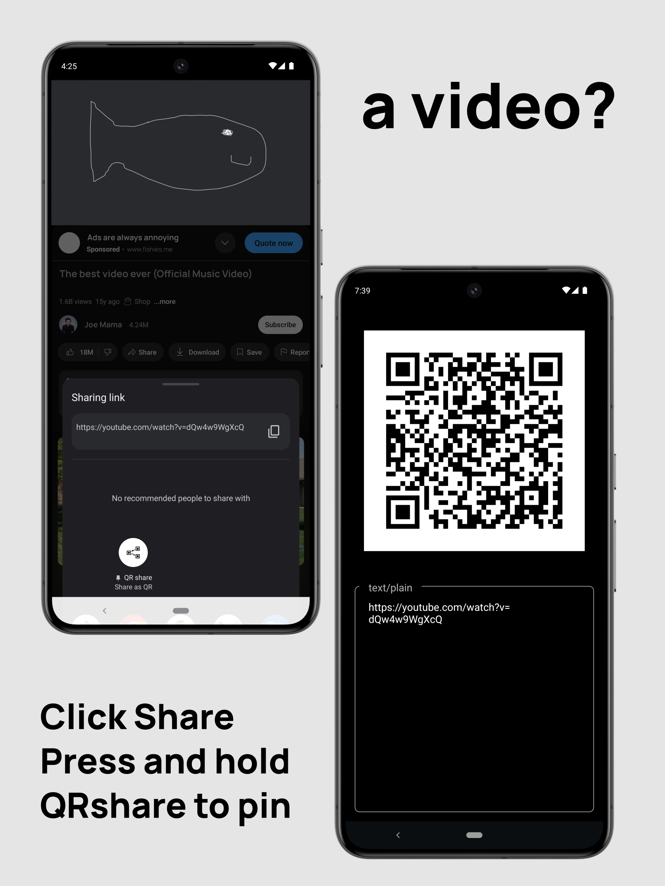
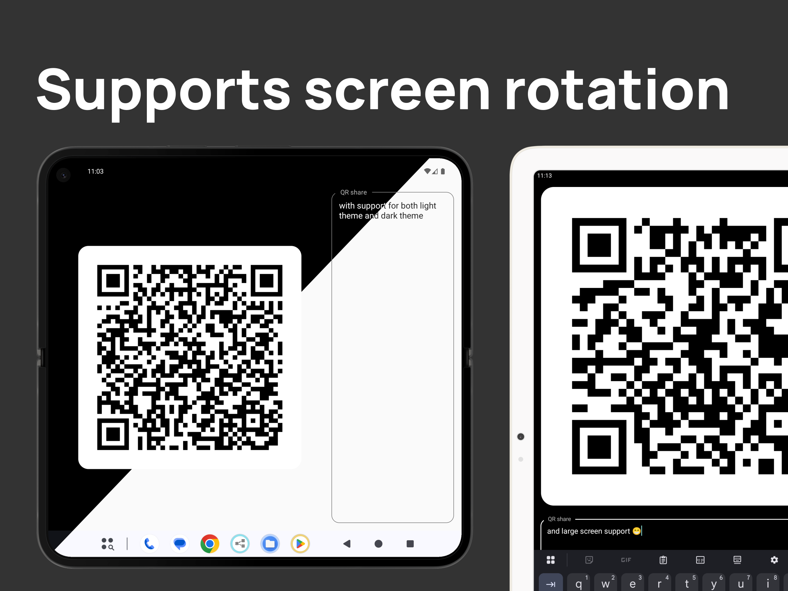

---

### Download

### Features:
- Dark and Light theme support
- Landscape + Portrait mode support
- Lightweight in size: Less than 1Mb in download + Bloat free!
- No ads
- Low memory usage: Will not spam the Recents screen (aka Overview)

 

- Anti-feature:
  - The lack of QR code scanning

### Usage:
- Opening the app:
  - Open any app > Click share > Select QRshare in the share sheet
  - Copy any text > Click the share icon on the android copy dialogue > Select QRshare in the share sheet
  - Or open the app from the app launcher
- Tap on the text box to edit or add text. The QR code will automatically update when the text changes
- Press and hold on the image to bring up options to copy the image to clipboard, or share the QR code to another app

<h3>Use cases:</h3>

- Sharing links quickly.
  - eg:
    - Sharing app links for profiles: Instagram / Venmo / Whatsapp / Telegram / etc.
    - Web pages
- Sharing contacts
  - Contact app > Share > QRshare
- Sharing text files
  - File manager > Share > QRshare

<h3>WearOS:</h3>

- Not supported in master branch, but [a rudimentary draft can be found on the wear branch](https://github.com/mrwm/QRshare/tree/wear).
- Will not be merged in master branch, as it includes Google Play Services.

### Images

